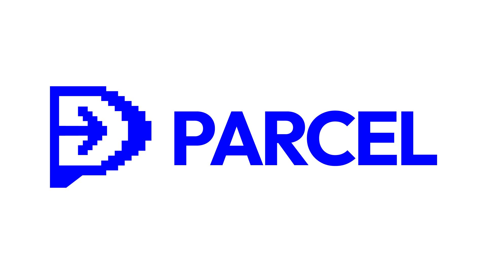

# Parcel



Parcel is a self-hostable, end-to-end encrypted (E2EE) collection manager. It allows you to gather links, text notes, and secure secrets into bundles, save them privately, and share them securely—all while verifying the server *never* sees your unencrypted data.

<!--ARCADE EMBED START--><div style="position: relative; padding-bottom: calc(56.8587% + 41px); height: 0px; width: 100%;"><iframe src="https://demo.arcade.software/IMI2hsPKpcfxKgA6pZq6?embed&embed_mobile=inline&embed_desktop=inline&show_copy_link=true" title="Share Data Securely with PARCEL" frameborder="0" loading="lazy" webkitallowfullscreen mozallowfullscreen allowfullscreen allow="clipboard-write" style="position: absolute; top: 0; left: 0; width: 100%; height: 100%; color-scheme: light;" ></iframe></div><!--ARCADE EMBED END-->

## Features
- **Zero-Knowledge Backend:** Powered by Cloudflare Workers & R2. It only stores heavily encrypted blobs.
- **Client-Side Encryption:** Your data is encrypted locally using AES-GCM (256-bit) and Argon2id.
- **Secure Sharing:** Shared links decrypt entirely in the browser. The decryption key is passed via the URL fragment (`#key`), which is completely invisible to the host server.
- **Browser Extension:** Includes a native extension to seamlessly capture links and resources directly into your secure vault.

## Architecture
- **Worker (`worker/`):** The dumb storage backend.
- **Editor (`apps/editor`):** Your private dashboard to create and manage bundles.
- **Viewer (`apps/viewer`):** The public, read-only interface where shared links are decrypted.
- **Extension (`apps/extension`):** The browser extension.

---

## Quick Deploy Guide
**Prerequisites:** Node.js v18+, a Cloudflare Account, and Wrangler installed (`npx wrangler login`).

### 1. Generate Your API Auth Key
Before deploying, you need to generate a secure key to lock down your backend so random people can't upload data to your Cloudflare account. 
Start the local development server:
```bash
npm install
cd apps/editor && npm run dev
```
Open the **Editor** at `http://localhost:5173`. On the login screen, click **"Generate Secure Key"**. Click **Copy** to save it to your clipboard.

### 2. Setup & Secure the Backend
Now, initialize your Cloudflare R2 bucket, inject your newly copied Auth Key, and deploy the Worker:
```bash
npx wrangler r2 bucket create parcel-storage
cd worker

# It will prompt you for a value. Paste your copied Auth Key!
npx wrangler secret put AUTH_KEY 

npm run deploy
```
*Note the URL it generates for you (e.g., `https://parcel-worker.yourdomain.workers.dev`).*

### 2. Configure Environment Variables
In `apps/editor/`, `apps/viewer/`, and `apps/extension/`, create a `.env.local` file (or append them to your `wrangler.toml` files for production):

```env
# Point this to the Cloudflare Worker URL you just deployed
VITE_API_URL="https://parcel-worker.yourdomain.workers.dev"

# Point this to where you plan to publicly host the Viewer application
VITE_VIEWER_URL="https://viewer.yourdomain.com"
```
*(The Editor requires `VITE_VIEWER_URL` so it natively formats the shareable links you generate!)*

### 3. Deploy the Apps
Run the following command to build and deploy the apps:
```bash
npm run build && cd apps/editor && npx wrangler deploy && cd ../viewer && npx wrangler deploy
```

### 4. Install the Extension
Load the `apps/extension/dist` folder into Chrome/Brave/Arc as an "Unpacked Extension". It easily utilizes the exact same backend variables to sync securely!

---

## ⚠️ Important Warning
**Don't lose your password.** All encryption strictly happens right on your device. The server literally cannot read your data. If you completely forget your master password, your saved bundles are cryptographically irrecoverable.

---

## License
This project is licensed strictly under the [GNU Affero General Public License v3.0 (AGPL-3.0)](LICENSE).
